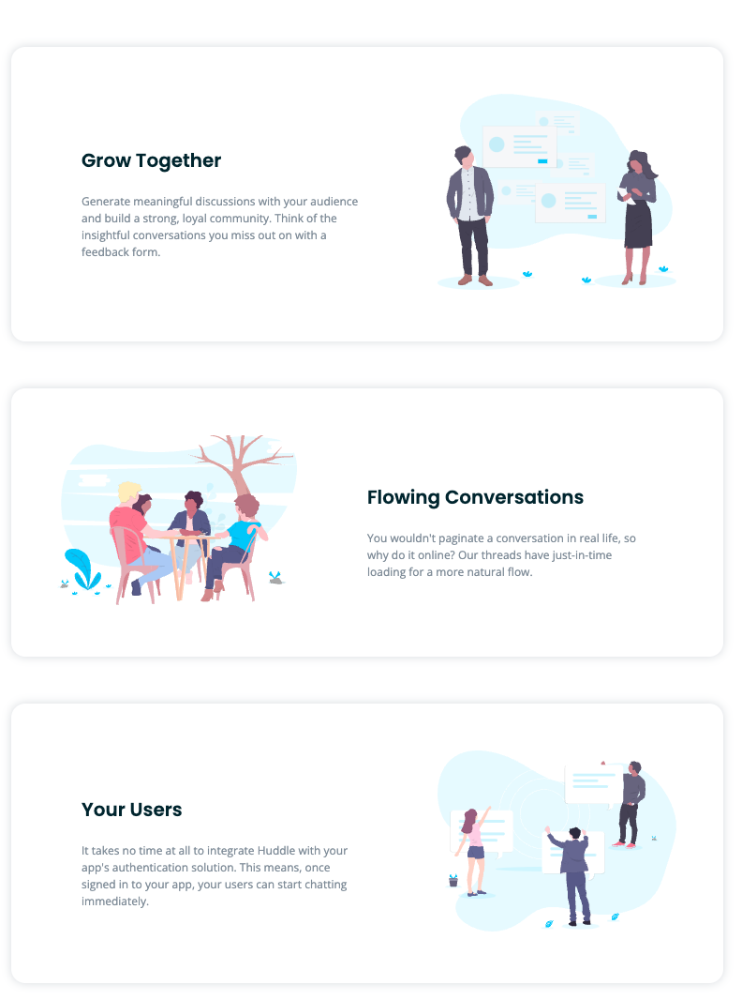

# Frontend Mentor ⇒ [Huddle landing page](https://www.frontendmentor.io/challenges/huddle-landing-page-with-alternating-feature-blocks-5ca5f5981e82137ec91a5100)


## Summary

This is a solution to the [Frontend Mentor](https://www.frontendmentor.io) challenge to recreate the [Huddle landing page](https://www.frontendmentor.io/challenges/huddle-landing-page-with-alternating-feature-blocks-5ca5f5981e82137ec91a5100). Frontend Mentor challenges help you improve your coding skills by building realistic projects.

I built this project to practice React and React Styled Components.

## Table of contents

- [Overview](#overview)
  - [The challenge](#the-challenge)
  - [Screenshot](#screenshot)
  - [Links](#links)
- [My process](#my-process)
  - [Built with](#built-with)
  - [What I learned](#what-i-learned)
  - [Continued development](#continued-development)
  - [Useful resources](#useful-resources)
- [Author](#author)

# Overview

## The challenge

### Users should be able to:

- [x] View the optimal layout for each page depending on their device's screen size
  - [x] <b>Mobile</b> @ 375px
  - [x] <b>Tablet</b> @ 768px
  - [x] <b>Desktop</b> @ 1275px
- See <b>hover</b> states for all interactive elements throughout the site
  - [x] <b>Button</b> `background-color` and `transform` updates on <b>hover</b>
  - [x] <b>Links</b> `color` updates on <b>hover</b>
        
## Screenshots

### - Mobile @ <b>375px</b>


- Desktop @ <b>1275px</b>


 
- <b>Hover States</b>


### Links

- Solution URL: [View Solution here](https://www.frontendmentor.io/solutions/huddle-landing-page-using-react-react-styled-components-and-sass-e17B_UO4t)
- Live Site URL: [View Live Site here](https://distracted-davinci-033bd1.netlify.app/)

## My process

### Built with

- <b>[React](https://reactjs.org/)</b> - JavaScript Framework
- <b>[React Styled Components](https://styled-components.com/)</b> - For styles
- Semantic <b>HTML5</b> markup
- <b>Sass</b> 
  - <b>CSS</b> custom properties
  - <b>Flexbox</b>
- <b>Mobile-first workflow</b>
  - <b>Mobile</b> breakpoint: 375px
  - <b>Tablet</b> beakpoint: 768px
  - <b>Desktop</b> breakpoint: 1275px
 
### What I learned

- The main motivation for completing this project was to get more pracgice with RSC.  I feel very comfortable with RSC now.

- An interesting snippet of code from this project is
I dynamically rendered the card content. but on the desktop the image and the text would alternate positions with each card. So in `Card.styled.js`
I used 
````
@media (min-width: ${({ theme }) => theme.tablet}) {
    flex-direction: ${({ layout }) => layout || "row-reverse"};
    ...
}
````
and in <Card/> alternated ` flex-direction` based on the card `id`
````
 <StyledCard layout={id % 2 === 0 && "row"}>
````
 To get this



If you want more help with writing markdown, we'd recommend checking out [The Markdown Guide](https://www.markdownguide.org/) to learn more.

**Note: Delete this note and the content within this section and replace with your own learnings.**

### Continued development

Use this section to outline areas that you want to continue focusing on in future projects. These could be concepts you're still not completely comfortable with or techniques you found useful that you want to refine and perfect.

**Note: Delete this note and the content within this section and replace with your own plans for continued development.**

### Useful resources

- [Example resource 1](https://www.example.com) - This helped me for XYZ reason. I really liked this pattern and will use it going forward.
- [Example resource 2](https://www.example.com) - This is an amazing article which helped me finally understand XYZ. I'd recommend it to anyone still learning this concept.

**Note: Delete this note and replace the list above with resources that helped you during the challenge. These could come in handy for anyone viewing your solution or for yourself when you look back on this project in the future.**

## Author

- Website - [Add your name here](https://www.your-site.com)
- Frontend Mentor - [@yourusername](https://www.frontendmentor.io/profile/yourusername)
- Twitter - [@yourusername](https://www.twitter.com/yourusername)

**Note: Delete this note and add/remove/edit lines above based on what links you'd like to share.**

## Acknowledgments

This is where you can give a hat tip to anyone who helped you out on this project. Perhaps you worked in a team or got some inspiration from someone else's solution. This is the perfect place to give them some credit.

**Note: Delete this note and edit this section's content as necessary. If you completed this challenge by yourself, feel free to delete this section entirely.**
